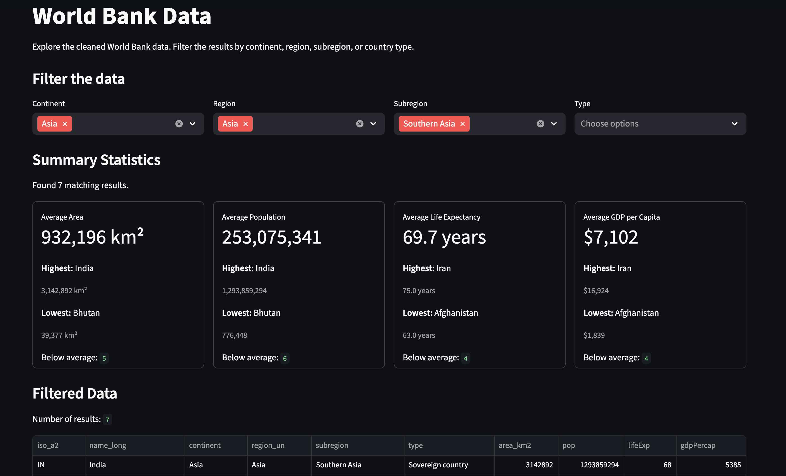
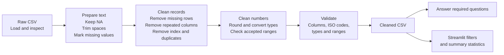

# World Data Challenge

## Summary
This project cleans and analyses the `worldData.csv` dataset, which is
based on the `worldData` dataset provided.

The original dataset contained 189 rows and 12 columns. After removing
missing, duplicated, and invalid records, the cleaned dataset contained
143 rows and 10 columns.

The project uses Python, pandas, Streamlit, and pytest to:

- clean and validate the original country data;
- answer the four questions included in the challenge;
- filter data by continent, region, subregion, and country type;
- display summary statistics for area, population, life expectancy, and GDP per capita;
- allow users to view and download the filtered data;
- test the main cleaning, caculate, and interface functions.

## Interface Preview

## Project Structure

## Approach

The project follows the process below:

The project is divided into three main parts:

1. `cleandata.py` prepares, cleans, validates, and exports the data.
2. `question.py` calculates the answers using the cleaned data.
3. `interface.py` filters the cleaned data and displays summary statistics.

The detailed cleaning steps and decisions are explained in the
Data Cleaning Process section.

## Main Results

### 1. Data Cleaning

### 2. Required Questions

### 3. Interactive Interface